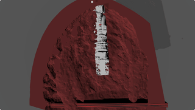

## Work journal

### Week of August 31st - September 4th, 2020

#### Sep. 4th
- Suction control
    - Testing optimal starting point

#### Sep. 3rd
- Suction control
    - Coding new simulation wrapper to handle optimal starting point

#### Sep. 2nd
- Suction control
    - SDF of complicated meshes
        - Tuning the mesh-to-SDF parameters doesn't seem to help the instabilities
        - Might transition to hand-crafted models with more well-behaved meshes
    - Optimal starting point selection
        - We can sample particle positions then run a longer simulation with MPC control
        - The best starting point is the one with the lowest average number of particles

#### Sep. 1st
- Suction control
    - Tested MPC control for box and and sphere obstacle scenes
    - Tested SDF for complicated meshes
        - Currently has some boundary problems, might need better/more accurate SDF generation as well as damping

#### Aug. 31st
- Suction control
    - Implemented gradients for SDF based collision

### Week of August 24th - August 28th, 2020

#### Aug. 28th
- Suction control
    - Integrated SDF checking with PBF simulation
    - Tested with box and sphere shape

#### Aug. 27th
- Suction control
    - Implemented collision and boundary checks using SDF representation of solid volume

#### Aug. 26th
- Suction control
    - Gradient issues
        - The large gradients might actually be correct, just comes from the fact that as the number of particles increase, there are more interactions
        - We can normalize the gradients such that no component is larger than 1, which leads to good results for MPC
    - SDF representation of obstacles
        - Use the mesh_to_sdf libarary to convert arbitrary trimesh into SDF
        - Use numpy.gradient to numerically differentiate the SDF and get normal directions
        - Collision can be implemented as pushing the particle along the normalized normal with distance given by SDF
        

#### Aug. 25th
- Suction control
    - The exploding gradient is due to the h parameter being too small, which was changed when we saled down the simulation
    - Still have issues of large gradients when the number of particles is large

#### Aug. 24th
- PyFlex render
    - Implemented cohesion forces, which was important in creating smooth fluid surfaces with surface tension
    - Cohesion forces seems to solve the boundary issues and particle clumping and produces better looking fluids
- Suction control
    - Some exploding gradient issues after down scaling and cohesion implementation
    - So far the problem has been isolated to the the down-scaled suction fields, likely the gradients are exploding due to very sharp changes in the sigmoids

### Week of August 17th - August 21st, 2020

#### Aug. 21st
- PyFlex render
    - Tuning simulation parameters to have btter visualization
    - Problem is most likely caused by boundary conditions

#### Aug. 20th
- PyFlex render
    - Can load simulated particle positions, render, and save results
    - Has a problem where the particle size is much smaller in Flex compared to our own PBF
    - This results in the particles being too sparse
    - Increasing rest density of the fluid in our own simulation can make the fluid less sparse, but they still show up as individual drops

#### Aug. 19th
- PyFlex render
    - Did some simple tests to have PyFlex render particles with external position information
    - Making a custom scene that can be easily changed to match simulation in Python without recompiling C++

#### Aug. 18th
- Suction control
    - Tested more MPC with obstacles

#### Aug. 17th
- Suction control
    - Added geometric obstacle in scene
    - The suction trajectory seems good

### Week of August 10th - August 14th, 2020

#### Aug. 14th
- Suction control
    - Gradient debugging, discovered bug that caused the gradients to explode
    - Re-run MPC tests

#### Aug. 12th
- Suction control
    - More tests reveal that tool always move to the same corner of the environment

#### Aug. 11th
- Suction control
    - Better trajectory that seems to suction the fluid
    - But it fails near the end

#### Aug. 10th
- Suction control
    - Implemented new smooth suction
    - Prelim test shows tool moves to corner then stops moving

### Week of August 3rd - August 7th, 2020

#### Aug. 7th
- Improving rendering
    - Changing the simulation particle radius
        - Smaller radius leads to smaller overall volume in render, but does not lead to smoother fluid surfaces
        - 1st is 0.3 (default); 2nd is 0.1

            

            

    - Additional Gaussian smoothing
        - Effective at smoothing the fluid surface, we can control the smoothing effects by changing the variance of the Gaussian kernel and the number of smoothing iterations
        - 1st is var=5, stronger post-smoothing; 2nd is var=3, less post-smoothing

            

            

#### Aug. 6th
- Setting up Linux system for potential PyFleX integration

#### Aug. 5th
- Suction control
    - More debugging and testing using the simple field

#### Aug. 4th
- Suction control
    - Current problem
        - The suction field only affects the particles when they are very close
        - So we don't get gradients until then 
        - Hard boundaries in the field, not differentiable
    - New ideas
        - New suction field that is continuous and differentiable everywhere

#### Aug. 3rd
- Suction control
    - Testing implementatoin of new formulation
        - Debugging and tunning the suction force values
    - TODO
        - Adjust loss formulation to count all particles emitted
        - Make upward suction force small so it moves incrementally (more differentiable?)
        - Make the suction field larger to avoid getting 0 gradients
        - Make a continuous field? Somehow have a big field that can approximate the suction behaivor for the whole environment, to avoid non-differnetiability at boundaries

### Week of July 27th - July 31st, 2020

#### July 31st
- Suction control
    - Implementing new formulation and gradients

#### July 30th
- Fluid rendering
    - Rerun simulation to get ground truth 
    - Fixed issues with ground truth generation with Unity fluid rendering

#### July 29th
- Suction control
    - Coding newly formulated suction
    - Fixing old code to be fully compatible with 3D gradients

#### July 28th
- Suction control
    - Tested old MPC in 3D with rendering
        - Results show that the old hueristics are not good
    - Started writting up new formulation

#### July 27th
- Suction control
    - Implementing previous MPC routines for 3D simulation
    - Started work on improving the formulation
        - Might be more optimal to move the end effector to the area with highest volume value, which should reflect the largest cluster of fluid
        - Begin work on a formulation that does not explicitly move the end effector position
            - This was based on human intuition of moving the tool towards the blood, which maybe not be globally optimal
            - Taking inspiration from grid-based simulations, we can think of suction as actuation applied to the grid
            - By using forces to move the particles to some dummy target location, we can get a differentiable suction process, instead of deleting particles
            - With better defined target states, we can optimize following established fluid MPC routines

### Week of July 20th - July 24th, 2020

#### July 24th
- Blood sim and render
    - Created new scene with deep cavity and fluids emitting from the bottom
    - Recorded data with multiple emission speeds

#### July 23rd
- Fluid meshing
    - PyRender
        - Fixed issue with the mesh being in the wrong orientation during render
        - Importing meshing utilities in the simulation class file causes numpy problems, consider importing outside and passing in neccesary functions
        - GIF saving using PyRender viewer is based on screen recording, this means the GIF includes the delay in the processing and it is not smooth, consider using headless rendering for better visualization
        - PyRender stuff is lower priority now
    - Next step focus on incoporating volume information into controls

#### July 22nd
- Fluid meshing
    - Marching cubes
        - We can get smooth meshes by using a smooth volume embedding, this means we don't do thresholding after the Gaussian smoothing
        - Then Skimage MC can generate smooth meshes as well, and the whole pipeline can run on Windows
    - PyRender
        - Animation rendering works, but pretty slow, need to speed up volume generation
            - Testing with a smaller volume for now
        - How to record gif in PyRender? The built-in key doesn't seem to be working
        - How to set proper camera angle

#### July 21st
- Fluid meshing
    - Marching cubes
        - [Skimage marching cube](https://scikit-image.org/docs/stable/auto_examples/edges/plot_marching_cubes.html)
            - Doesn't have smoothing like ilastik, so the surface shading is not as good
            - Prelim results, sigma=3, threshold=max/5
                - PyQt OpenGL renders

                    

                - PyRender

                    

    - PyRender fix
        - PyRender had visualization problems because back-face culling was on
        - This probably created artifacts because the mesh is not closed
        - Turning off BFC fixes the problem

            

    - Closed surface
        - Mesh surfaces are not closed when they are on the edge of the environment
        - Can pad the environment by one unit so marching cubes will close the surface
        - PyQt renders

            

            

        - PyRender

            

            

    - Point cloud and mesh comparison, first is point cloud based on particle position, second is PyRender of ilastik marching cubes

        

        

#### July 20th
- Fluid meshing
    - Using marching cubes to create mesh for volume
        - Basic pipline is
            1. Data generation, particle positions are stored in Numpy arrays
            2. Post-processing using Gaussian filter to create a volume
            3. Mesh generation using marching cubes
        - [PyMCubes](https://github.com/pmneila/PyMCubes)
            - DLL load fail when importing
        - [ilastik marching_cubes](https://github.com/ilastik/marching_cubes)
            - Package only works for Linux or OSX 
            - Using Linux subsystem on Windows to run this package
            - Some decent meshing results, first exp sigma=3, threshold=max/5, second exp sigma=3, threshold=max/8 (lower threshold, larger the mesh); all exps use 4 smoothing rounds
                - PyQt OpenGL renders

                    

                    

                - PyRender 

                    

                    

                - PyRender seems to have some problem with the mesh generated, but both are based on OpenGL, might be differences in the default shaders used

### Week of July 13th - July 17th, 2020

#### July 17th
- Fluid meshing
    - Extended the new simulation to 3D
    - OpenVDB [Github](https://github.com/theNewFlesh/docker_pyopenvdb)
        - This is used in commercial softwares like Houdini or Blender
        - Based on information from the DeepLagrangianFluids repository, the created meshes are rendered using Blender
        - Installation on Windows requires Docker which leads to problems
            - Can't run the start script unless using bash
            - Bash does not recognize the Python instllations
        - Trying to use the Linux subsystem on windows to as a work around
            - No success so far
        
        

#### July 16th
- Suction control
    - Preparing to extend forward simulation to 3D for mesh generation
- Fluid rendering
    - Prepared new cavity and datasets for Florian

#### July 15th
- Suction control
    - Tool orientation
        - Coded in forward and backard boundary conditions
    - Next steps
        - Added in forward and backward loss computation with tool orientation

#### July 14th
- Suction control
    - Particle weight by age doesn't work well
        - Movements are targeting points that don't make sense
    - Gradient checker
        - Not really working yet
        - Thinking about putting this on hold and focus on the simple control first
    - Next steps
        - Tool orientation
        - Different cavity shapes

#### July 13th
- Suction control
    - Small fix to make the tool-fluid boundary condition more accurate
    - Implemented projection idea
        - Movement is too jerky, not practical to do
        - In reality the fluid will not be so particlized, so it's not really necessary 
        - Perhaps only use it when the fluids are sparse and tool is not moving enough
    - Tested several modifications to the optimal control formulation
        - Use discount idea from Markov-decision processes, put more weight on the earlier steps in the trajectory
        - Compare the effects of different horizon lengths, images are 9 steps, 5 steps, 1 step

            

            

            

        - Next implement per particle weighting and put more weights on particles that existed for longer
            - Fits intutition that we want to remove particles fast
            - Possibly break ties in equidistant cases

### Week of July 6th - July 10th, 2020

#### July 10th
- Suction control
    - Implemented MPC routine
        - A main sim is considered the ground truth, at each timestep, the particle states are used to initialize an auxiliary sim
        - The auxiliary runs for 10 steps and gradient descent is used to find the optimal tool trajectory
        - The first step from the trajectory is taken, then the process is repeated
    - Test 1 and 2
        - Tool is allow to move after main sim is at 50 steps
        - L2 loss

            

    - Test 3
        - Tool is allow to move after main sim is at 50 steps
        - L1 loss

            

    - L1 loss seem like a better heuristic, less likely to be at a position that doesn't suction anything

    - Gradients from solid-fluid coupling are problematic, seem to add some non-smooth movements
        - Gradient could be exploding
        - Possible mistake in derivation and implementation 

            

    

#### July 9th
- Suction control
    - Implemented new loss that penalizes every timestep and resulting tool movements are much more sensible
        - For simple case where the tool can act as soon as particles come out, the tool will stay at the emission point and leads to very good loss

            

        - The gradients backprop through the particle positions back to the tool positions (solid-fluid one-way coupling) are not very good, it leads to spasmic movements
            - At this point not sure if the numerical values are just very unstable or if I have errors implementing the gradients

                

    - Distance based loss drives the tool to the centroid of the particles
        - This could be a problem when the centroid is not in the body of the fluid, resulting in no suction
        
            

        - Consider a kind of projection where we force the tool to go to the particle nearest to the solved optimal point

    - The gradients for the vertical components seem very small, so the tool doesn't go deep enough into the fluid
        - Can use a hack to weight the vertical component harder, or maybe use adaptive gradients to take larger steps then the gradient is very small
        

#### July 8th
- Differentiable simulation
    - Implmented proposed min distance loss and backpropagation to suction tool positions
    - Ran some simple tests
        - A trivial case of a few particles
            - The tool will converge to the center of the particles, which is what we expect since we want to minimize the distance between the tool and the particle in order to suction them
            - However the region in the center is empty, so the tool didn't do any suction
            - This is not that big of a problem because in a real case, the center of a group of particles should not be empty
        - A trajectory optimizatin test with 100 particles in 100 timesteps
            - Goal is to find optimal tool positions for all timesteps to remove as much particles as possible
            - We expect the tool to go to where the particles are emitted, to suction the particles as soon as they come out
            - Results show that the tool does tend to go to the emission point, but unintuitively, it doesn't stay there to suction all of the particles
    - Possibly new loss that penalizes all timeframes
        - Intuitively we want to suction all particles as fast as possible, so it makes sense to penalize a particle be existing
        - A trajectory optimizatin test with 100 particles in 100 timesteps
            - Result show that the tool is being driven towards the center of the fluid
            - Best results at around 200 iterations, in later iterations of gradient descent the trajectory gets worse
            - Even at the best iteration, there is a lot of spasmic movement, and has trouble going into the fluid

#### July 7th
- Differentiable simulation
    - Added in particle emission and particle state control for gradient computation
    - Formulated particle suction through deleteion as an optimization problem

#### July 6th
- Differentiable simulation
    - Fixed a mistake in propagating poly6 gradients
    - Put in clipping to ensure Spiky grad backward does not blow up
    - Put in clipping to ensure propagation through the lambdas path does not blow up
    - Finished multi-iteration solver and the backprop through it

### Week of June 29th - July 3rd, 2020

#### July 3rd

- Differentiable simulation
    - Finished most of gradients
        - Only one Jacobi iteration
            - Forward sim is slightly not stable because of this
            - Need to added the multi-iteration in
        - Need to add in the bound check after applying delta
    - Next check end-to-end optimiation on the full simulation
    - Next implement suction and its gradients

#### July 2nd
- Differentiable simulatioon
    - Finished deriving and implementing a draft of backprop for core solver iteration, need to test and debug
        - Preliminary tests seem ok, do gradient descent test tomorrow
    - Next steps
        - Include data structure to handle multi-step simulation
        - Include data structure to handle multi-iteration core solver
        

#### July 1st
- Differentiable simulation
    - Derived gradients for computing density constraint Lagrange multipliers
    - Implemented the above gradients
        - Seems correct so far, can use gradient descent to drive lambdas toward desired value
        - Need more extensive tests to make sure the gradients are correct, can try to use automatic numerical gradients for comparison
    - Next steps are implementing the rest of PBF

#### June 30th
- Taichi
    - Implementing suction
        - Suction apparatus is coded as a boundary condition
        - The apparatus rectangle can move and affect (push) the particles
        - Suction is coded as removing particles that are within some distance from the the bottom of the apparatus

        

    - Moving to use hand derived gradients for differentiable simulation
        - Implemented and testing backprop for gravity and position-based velocity update

#### June 29th
- Taichi
    - Implemented fix for "stmt ... cannot have operend ..." in update grid kernel
        - The return from atomic_add can not be used for indexing for some reason
        - Previous fix is not thread-safe (simultaneous read of index, and thus writting to the same index)
        - Changed grid2particle to an indicator tensor and use the particle ID as index
        - This is a messy work around
        - Might decrease performance since we have to do a longer loop when checking neighbors, but should be fine
    - compute_lambdas gradient accumulation also has "stmt ... cannot have operand ..." error
        - Can't add the results from spiky_gradient to grad accumulator?
        - Did some major rewrite, with global data structure and kernel simplicity rule
        - Seems like the problem is when trying to accumulate a Taichi function return?
        - Possibly a bug? Currently can't think of any work-arounds like the grid_update issue
    - Need to have some random offsets when handling boundary condition, but it seems to mess with auto-diff
    - Overall progress on differentiable simulation is hindered by Taichi issues
        - Somewhat hard to debug since this error message is not well documented
        - Statements that are similar can work or break, so it's hard to isolate issues

### Week of June 22nd - 26th, 2020

#### June 26th
- Taichi
    - Tested simple end-to-end optimization
        - Using gradient descent to select the right initial velocity to reach the target positions in 3D projecile motion

#### June 25th
- Taichi
    - Working more on end-to-end differentible PBF sim
    - Some simple propagations work
        - Propagating from initial position to end position by gravity only, without boundary, is verified with hand-derived computational graph

            

    - Note gradients are just numbers, need to make sure the loss and corresponding gradients make physical sense and possibly reconsider if the operations can be differetiated in a sensible way
        - Example: particle falling from only gravity, with ground as boundary, for *t* steps, what is derivative of its final height with respect to its initial height? h_f = h_i + v_i t + 1/2 g t^2
            - If particle is still in free-fall at *t*
                - Increasing initial height will also increase height at *t* by same armound, derivative should be 1
                - Taichi AD matches in the discretized version
            - If particle hits the ground at exactly *t*
                - Left derivative is 0; decreasing initial height will lead to ball hitting ground earlier, but its height at *t* is still on the ground, so decreasing initial height does not change height at *t*
                - Right derivative is 1; increasing initial height will lead to ball hitting ground later, so its height at *t* will be increased by the same amount
                - Taichi AD gives 0 in the discretized version
            - If particle hits the ground some time before *t*
                - Derivative is similar to the previous case, but right-shifted by same amount as the time of impact
                - Taichi AD gives -1 in the discretized version
        - Example: [time discretization itself is not differentiable](https://arxiv.org/pdf/1910.00935.pdf)

    - More problems with AutoDiff that are not fully understood
        - ti.random() will not work
        - Emitting particles does not work
            - Unsupported Numpy operations?
            - Assigning particle active indicators does not work?
        - Update grid function does not work
            - Simply accessing and assigning indicator to a global tensor causes problem
        - Error in the form "stmt {} cannot have operand {}."
            - Seems to comes from some kind of [checker](https://github.com/taichi-dev/taichi/blob/master/taichi/analysis/verify.cpp) to make sure the operations to differentiate is supported

    - Consider different ways to do end-to-end gradient
        - If some sub-steps can't be done with AutoDiff, we can exclude it
        - For example, emitting and grid update doesn't work, but they simply set indicators and do house keeping
        - Just differentiate the sub-steps that make use of these indicators, which should be consisting of simpler differentiable operations
        - Backpropagated the gradients across the chain of sub-steps by hand (mostly just multiplying with chain rule)
        - Backpropagate across timesteps by hand (more chain rule)
        - This could give more control over how the overall gradient is computed, and allow us to handle special cases

#### June 24th
- Taichi
    - Watched Taichi Lecture 4
    - Worked on implementing differentiable simulation
        - Modified the data structure and class methods to keep tracks of particle information for each step
        - This is required for end-to-end differentiation, i.e, from initial conditions to loss evaluated on end state
        - For now can get one-step derivatives, still need to figure out how to do end-to-end, following [here](https://github.com/yuanming-hu/difftaichi/blob/master/examples/diffmpm.py)

#### June 23rd
- FleX in Unity
    - Generated several new renders
    - Implemented particle position extraction and mask creation

        

        

        

#### June 22nd
- FleX in Unity
    - Can export particle position 4-vectors in JSON, can be parsed in Python for ground truth
    - Finished building a scene using medical 3D printing models
    - Finished one render using this scene

        

- TODOs
    - Need to get camera view matrix to transform positions into pixel locations
    - Need to generate a ground truth plot with the pixel locationss

### Week of June 15th - 19th, 2020

#### June 19th

- Houdini rendering for fluids
    - Found out that Houdini crashes because geometry has infs, culprit is vorticity code
    - Turn off vorticity for now, will need to debug computations and hand-derived gradients
    - New render with fluid surfaces

        

        

- Surgical scene rendering
    - Haven't found any good (and free) texture and mesh assets that can be used for a more realistic render
- PBF in Taichi
    - Put the simulation code into a class, should be easier to modify for future use
    - Set up particle emission for bleeding simulation

        

- TODOs
    - Search more for surgical scene assets for rendering
    - Test more complex boundary conditions for Taichi PBF

#### June 18th

- Investigated interactive visualizaiton of point clouds
    - [pptk](https://heremaps.github.io/pptk/tutorials/viewer/tanks_and_temples.html)
        - Loading seems to have some issues
    - [Open3D](http://www.open3d.org/)
        - Can't create visualizer window!?!
- Houdini rendering for fluids
    - Crashes when trying to create polygon surfaces from particles
    - Most likly a hardware resource issue
- FleX in Unity
    - Can do a fluid simulation and render

        

        
    
- TODOs
    - [Previous MPM work](https://github.com/yuanming-hu/taichi_mpm) rendered with Houdini, take a look at that again?
    - FleX Unity
        - Need better assets (surgical scenes?) for better simulation
        - Need to get particle positions as ground truth ([maybe this](https://forums.developer.nvidia.com/t/unity-flex-particles-position/64968/7))
    - Try Blender for rendering

#### June 17th

- Taichi learning and experiments
    - Finished implementing vorticity confinement
    - Can now export PLY data to Houdini for rendering

        

- TODOs
    - Better rendering
        - Size of particles
            - [Particle attributes](https://www.sidefx.com/docs/houdini/model/attributes.html)
            - This is a requisite for particle fluid surface in Houdini
        - Fluid surface rendering
            - Marching cubes in Taichi to create all the polygons?
            - Generate surface polygons in Houdini?
                - [Particle fluid surface](https://www.sidefx.com/docs/houdini/nodes/sop/particlefluidsurface.html)
        - Boundary walls
    - Modularize the simulation code for easier future use

#### June 16th

- Taichi learning and experiments
    - Watched Taichi lecture 3
    - Implemented XSPH viscosity in position-base fluids
    - Front view of the 3D simulation, horizontal is x, vertical is z
    
        
        
    - Top view of the 3D simulation, horizontal is x, vertical is y

        
        
    - Derived gradients for vorticity confinement
- TODOs
    - Implement vorticity confinement
    - Need to validate results in 3D, not sure what's a good quantitative evaluation yet, have to rely on visuals for now
    - Visualization limited in Taichi, try exporting particles and rendering with Houdini

#### June 15th

- Discussion with Fei, settled on some big directions for project
    - Build a blood suction fluid simulator first
    - Possible future extensions
        - Learning dynamics in real-time for surgical robotcs
        - Robot control such as optimal suction placement and orientation, finding source of flow, etc
- Taichi learning and experiments
    - Watched Taichi lectures 1-2
    - Installed Taichi, started experimenting with it
        - Modified 2D PBD based simulation to 3D
- TODOs
    - Camera mapping: how to visualize the 3D results
    - More complex scene and evironment, instead of a retangular box

